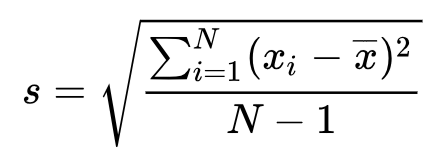

# Estimation Project #

In this project an autopilot is implemented with focus on estimation aspects for sensors and drone movement.
### Step 1: Calculate standard deviation ###

Gaussian distribution is useful in modelling sensor error and characterized by mean and standard deviation.  We take some sample IMU data and calculate these parameters which is a characterization of the sensor.  Such sensor characterization are used to model the sensor error used in the kalman filter.

The standard deviation is calculated by performing the math. 

python was used to extract the sample data and numpy to perform the calculation.

### Step 2: Attitude Estimation ###

A non-linear complementary filter is used to attitude estimation.  The IMU attitude is converted into the world frame, integrated by small time dt and combined with accelerometer readings.

### Step 3: Prediction Step ###

The motion matrix advances the motion of the drone and the state covariance matrix is updated at a small time step.  The class EKF update equations are used to update the covariance matrix which characterizes the new uncertainty of state.  

### Step 4: Magnetometer Update ###

A magnetometer sensor information is now added to the accelerometer and gyro for our state estimation in order to improve our yaw estimate.  In this case, we simply update directly.  

### Step 5: Closed Loop + GPS Update ###

GPS sensor updates are used to provide absolute state information periodically correcting for integration error associated with previous sensor acceleration measurements.

### Step 6: Adding Your Controller ###

Using my previous controller showed signficiant weakness in the design in term of stability which were subsequently corrected.

## Authors ##

Thanks to Fotokite for the initial development of the project code and simulator.
